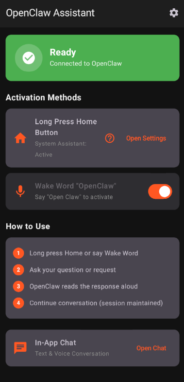

# OpenClaw Assistant

<p align="center">
  
</p>

**OpenClaw専用のAndroid音声アシスタントアプリ** - あなたのAIアシスタントをポケットに。

## ✨ 機能

- 🎤 **ウェイクワード「OpenClaw」** - 音声だけでハンズフリー起動
- 🏠 **ホームボタン長押し** - システムアシスタントとして動作
- 🔄 **連続会話モード** - セッションを維持して自然な対話
- 🔊 **音声読み上げ** - AIの応答を自動で読み上げ
- 💬 **In-App Chat** - テキスト＆音声のハイブリッド入力
- 🔒 **プライバシー重視** - 設定は暗号化保存

## 📱 使い方

1. **ホームボタン長押し** または **「OpenClaw」** と話しかける
2. 質問やリクエストを話す
3. OpenClawが音声で応答
4. 会話を続ける（セッション維持）

## 🚀 セットアップ

### 1. アプリのインストール

[Releases](https://github.com/yuga-hashimoto/OpenClawAssistant/releases) からAPKをダウンロード、またはソースからビルド。

### 2. 設定

1. アプリを開く
2. 右上の⚙️から設定画面へ
3. 以下を入力：
   - **Webhook URL** (必須): OpenClawのエンドポイント
   - **Auth Token** (任意): Bearer認証用

### 3. ウェイクワードの設定

1. [Picovoice Console](https://console.picovoice.ai) で無料アカウント作成
2. **Access Key** を取得して設定画面に入力
3. アプリでWake Wordトグルをオンに

### 4. システムアシスタントとして設定

1. アプリの「Open Settings」をタップ
2. または: 端末の設定 → アプリ → デフォルトアプリ → デジタルアシスタント
3. 「OpenClaw Assistant」を選択
4. ホームボタン長押しで起動可能に

## 🔧 OpenClaw側の設定

### Webhook設定例 (config.yaml)

```yaml
hooks:
  voice:
    path: /hooks/voice
    auth:
      bearer: "your-secret-token"
```

### リクエスト形式

```json
POST /hooks/voice
Content-Type: application/json
Authorization: Bearer <token>

{
  "message": "ユーザーの発話テキスト",
  "session_id": "uuid-xxx-xxx"
}
```

### レスポンス形式

以下のいずれかの形式をサポート：

```json
{"response": "応答テキスト"}
{"text": "応答テキスト"}
{"message": "応答テキスト"}
```

## 🛠 技術スタック

- **UI**: Kotlin + Jetpack Compose + Material 3
- **音声認識**: Android SpeechRecognizer
- **音声合成**: Android TextToSpeech
- **ホットワード**: Picovoice Porcupine
- **システム連携**: VoiceInteractionService
- **通信**: OkHttp + Gson
- **セキュリティ**: EncryptedSharedPreferences

## 📋 必要な権限

| 権限 | 用途 |
|------|------|
| `RECORD_AUDIO` | 音声認識 |
| `INTERNET` | API通信 |
| `FOREGROUND_SERVICE` | Wake Word常時検知 |
| `POST_NOTIFICATIONS` | ステータス通知 |

## 🤝 Contributing

Pull Requests歓迎！Issues報告もお気軽に。

## 📄 ライセンス

MIT License - 詳細は [LICENSE](LICENSE) を参照。

---

Made with ❤️ for [OpenClaw](https://github.com/openclaw/openclaw)
